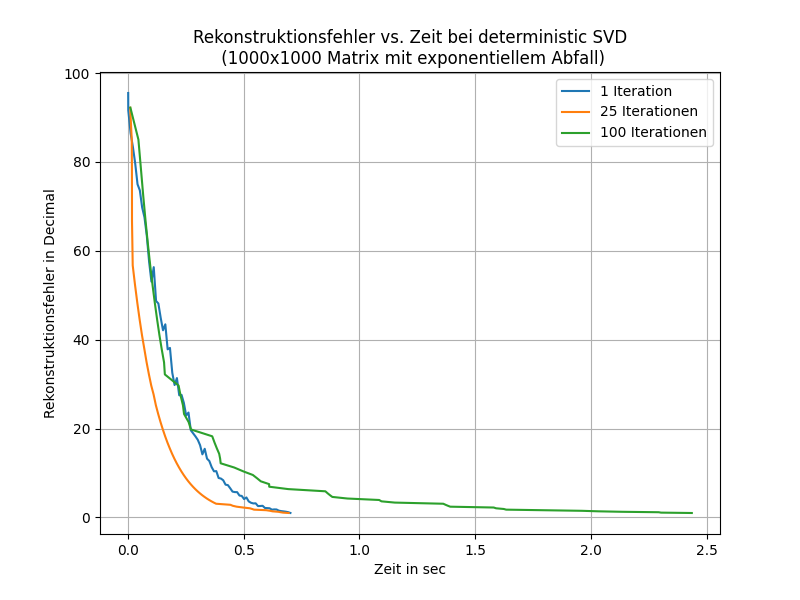
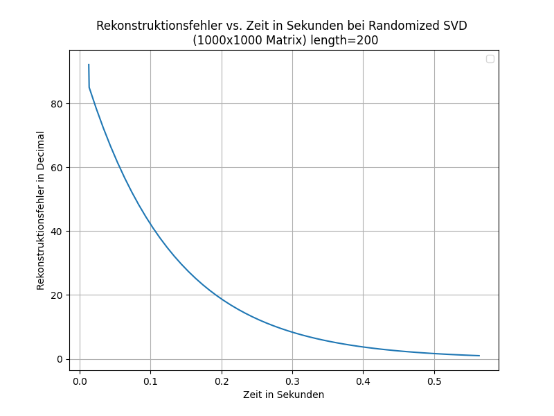
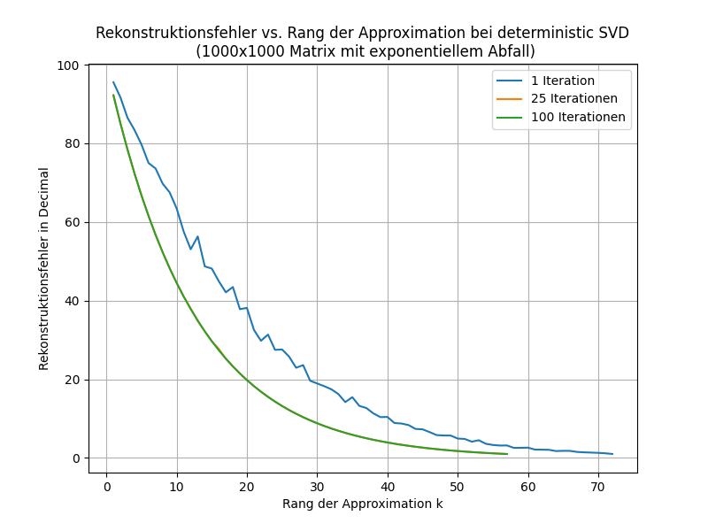

# High-Performance Benchmarking: Randomized vs. Deterministic Matrix Algorithms

## Overview
This repository contains the core benchmarking suite developed for my Bachelor's Thesis at the University of Tübingen. The project evaluates the trade-offs between randomized and deterministic algorithms in terms of **numerical stability**, **memory footprint**, and **computational latency** for large-scale datasets.

## Tech Stack
- **Language:** Python 3.x
- **Libraries:** NumPy, Pandas, Matplotlib (for data visualization)
- **Concepts:** Linear Algebra, Algorithm Engineering, Performance Profiling

## Key Features
- **Automated Benchmarking:** Custom-built suite to run extensive tests across varying matrix dimensions.
- **Numerical Stability Analysis:** Tools to measure error propagation in randomized vs. deterministic approaches.
- **Visual Reporting:** Automated generation of performance graphs (plots) to interpret high-dimensional data.

## Benchmarking Results

Here are some visual insights generated by the benchmarking suite, comparing the runtime and error propagation of the implemented algorithms:

<table>
  <tr>
    <td></td>
    <td></td>
  </tr>
</table>
<table>
  <tr>
    <td></td>
    <td></td>
  </tr>
</table>


*Figure 1: Comparison of execution time across error rate.*

*Figure 2: Comparison of execution error rate across different matrix dimensions.*

This suite helps in selecting the most cost-efficient algorithm for large-scale data processing, balancing the need for speed (latency) with the required precision (error margins).


## Running the Benchmarks

To reproduce the performance comparisons between Randomized and Deterministic SVD, you can run the benchmarking suite directly. The suite evaluates execution time and reconstruction error across various matrix dimensions and ranks.

### Prerequisites
Ensure you have the required packages installed:
```bash
pip install -r requirements.txt
```
### Run the main script to trigger the automated test scenarios:
```bash
python benchmark.py
```
### Which File?
• rand vs det new.py: Implementierung der randomisierten und determi-
nistischen SVD-Algorithmen.
• svd benchmark.py: Skript zur Durchf¨uhrung der SVD-Benchmarks
(Laufzeit- und Fehlervergleiche).
• mat mult alg.py: Implementierung der deterministischen und rando-
misierten Matrixmultiplikationsalgorithmen sowie zugeh¨origer Bench-
marks.
• svd komprimierung.py: Implementierung der Bildkomprimierung auf
Basis der SVD inklusive Tests.
• rand eigenfaces.py: Implementierung des Eigenfaces-Experiments mit
randomisierter SVD.

